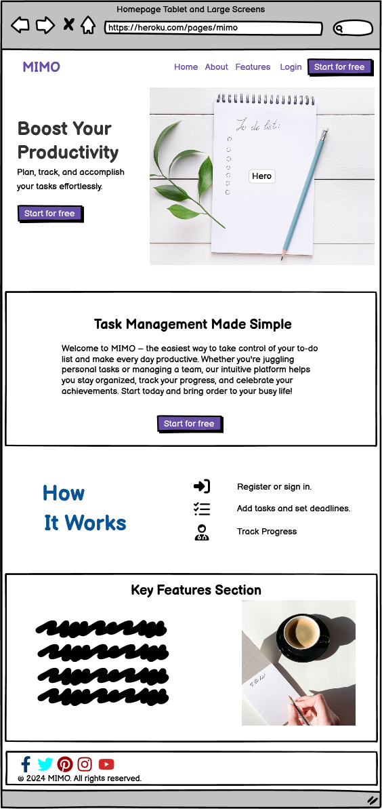
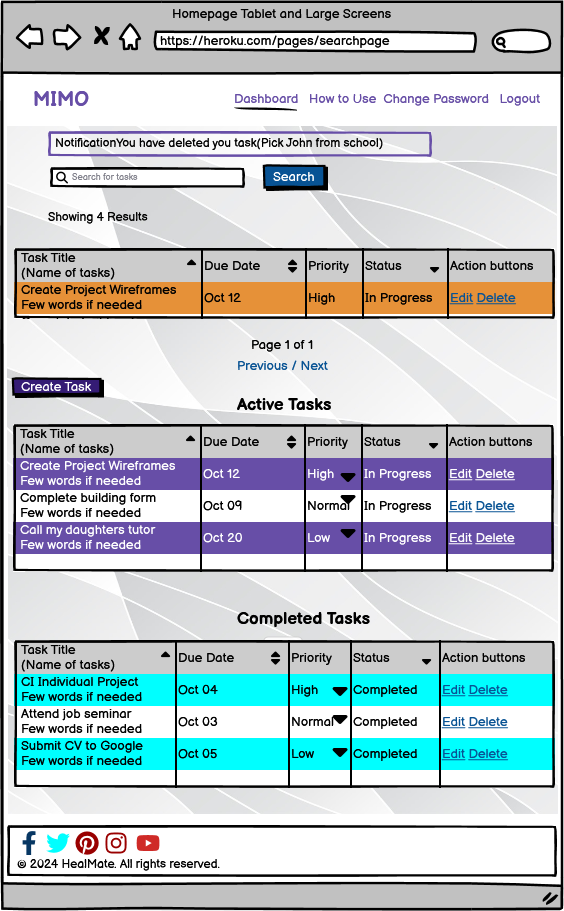
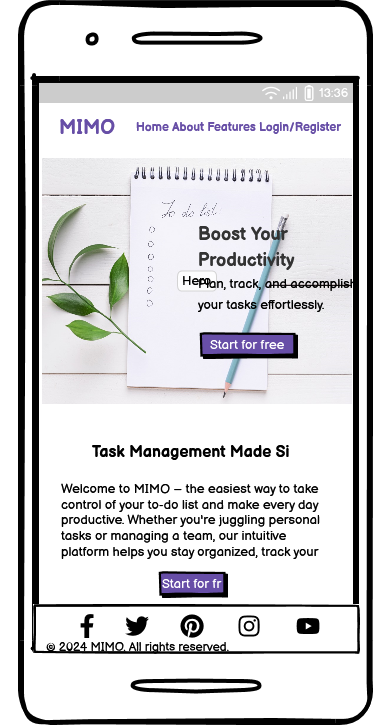
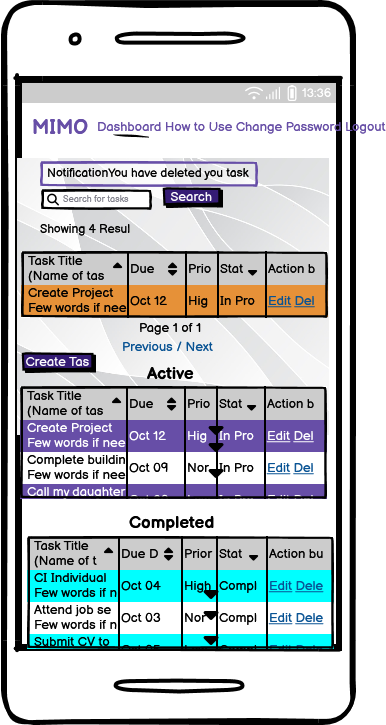

# MIMO - Mindful Intentions, Meaningful Outcomes

Mimo is a user-friendly task management app designed to help individuals and teams efficiently organize and prioritize their tasks, embodying the philosophy of "Mindful Intentions, Meaningful Outcomes." With features like project tagging and customizable task statuses, Mimo streamlines workflow management, allowing users to focus on what matters most.

## Live website

The live link can be found here - [MIMO](https://mimo-app-bab402704619.herokuapp.com/) 


## Purpose of the project
The purpose of a MIMO app is to help individuals and teams organise, prioritise, and track tasks efficiently to achieve specific goals or complete projects. The development is focusing on Django and Bootstrap frameworks, Database manipulation and CRUD functionality.

<hr>

## Table of Contents

- [MIMO](#mimo)
  - [Purpose of the project](#purpose-of-the-project)
  - [Table of Contents](#table-of-contents)
- [UX/UI](#ux---user-expirience)
  - [User Stories](#user-stories)
  - [Design Inspiration](#design-inspiration)
  - [Wireframes](#wireframes)
  - [Final View](#final-view)
- [Features](#features)
  - [Existing features](#existing-features)
  - [Features left to implement](#features-left-to-implement)
- [Database Schema - Entity Relationship Diagram](#database-schema---entity-relationship-diagram)
- [Agile Methodologies - Project Management](#agile-methodologies---project-management)
  - [MoSCoW Prioritization](#moscow-prioritization)
- [Deployment](#deployment)
  - [Connecting to GitHub](#connecting-to-github)
  - [Django Project Setup](#django-project-setup)
  - [Cloudinary API](#cloudinary-api)
  - [Heroku deployment](#heroku-deployment)
- [Technologies Used](#technologies-used)
- [Testing](#testing)
  - [Validator testing](#validator-testing)
    - [HTML](#html)
    - [CSS](#css)
    - [JavaScript](#javascript)
    - [Python](#python-validation)
    - [Lighthouse](#lighthouse)
    - [Wave](#wave-accessibility-evaluation)
  - [Manual Testing](#manual-testing)
- [Credits](#credits)
  - [Content](#content)


# UX - User Expirience

## User Stories:

| User Story | Priority |
|----------------------------------------------------------------------------------------------------------------------------|---------------|
| As a user, I want to register and log in so that I can save my tasks securely and access them from any device | **MUST HAVE** |
| As a user, I want to add new tasks to the task manager so that I can track the tasks I need to complete. | **MUST HAVE** |
| As a user, I want to mark a task as completed so that I can track which tasks I have finished. | **MUST HAVE** |
| As a user, I want to delete a task so that I can remove tasks that are no longer needed. | **MUST HAVE** |
| As a user, I want to view a list of all my tasks so that I can see what tasks I have to complete. | **MUST HAVE** |
| As a user, I want to have the ability to prioritize tasks so that I can focus on the most important tasks first. | **SHOULD HAVE** |
| As a user, I want to edit an existing task so that I can update details if the task changes. | **SHOULD HAVE** |
| As a user, I want to see a count of how many tasks I have, how many are completed, and how many are pending so that I can easily understand my progress. | **SHOULD HAVE** |
| As a user, I want to filter tasks by their completion status so that I can focus on unfinished tasks. | **SHOULD HAVE** |
| As a user, I want to set due dates for tasks so that I can manage my deadlines. | **COULD HAVE** |
| As a user, I want to be able to search for tasks by their title so that I can quickly find a specific task. | **COULD HAVE** |
| As a user, I want to categorize tasks (e.g., Work, Personal, Urgent) so that I can organize my tasks more effectively. | **COULD HAVE** |
| As a user, I want to receive reminders for upcoming due dates so that I can stay on track with my tasks. | **COULD HAVE** |
| As a user, I want to have the ability to share tasks with other users or collaborate on tasks. | **COULD HAVE** |
| As a user, I want to sync my due dates with a calendar app (e.g., Google Calendar) to manage my tasks alongside other events. | **COULD HAVE** |
| As an Admin, I want to add/update/delete articles on the Home page, so the user can receive useful information about time-managment | **WON'T HAVE** |
  

## Design Inspiration


### Colour Scheme

As a main colours, we used ``` ``` colour for the text and ```  ``` for block background to make content more readable.

Colour Blind Safe and contrast was checked by [Adobe Color](<https://color.adobe.com/create/color-accessibility>)


*Accessibility check for colour scheme*

This was handled via Dalton


https://chromewebstore.google.com/detail/colorblind-dalton-for-goo/afcafnelafcgjinkaeohkalmfececool?hl=en


*Contrast checker*


*Colour Scheme*

### Font

Using [Google Font](<https://fonts.google.com/>), we imported "Catamaran" to the CSS file and set it as the default font. 

## Wireframes

__Browser View:__

<details open>
    <summary>Home page tablet and large screens for logged out user</summary>  
      
</details>

<details open>
    <summary>Dashboard tablet and large screens for logged in users</summary>  
      
</details>

__Phone View:__

<details open>
    <summary>Home page mobile for logged out user</summary>  
      
</details>

<details open>
    <summary>Dashboard mobile for logged in users</summary>  
      
</details>

## Final View

<details open>
    <summary>Browser view of home page</summary>  
      
      
      
</details>

<details>
    <summary></summary>  
      
</details>


# Features 

User Authentication


Users can securely register, log in, and log out to manage their personal task lists.
Each account is protected to ensure tasks are private and accessible only by the owner.
Task Management

Interactive actions like task creation, deletion, login, and logout trigger toast notifications, providing immediate feedback on success or failure.


Users can create, edit, and delete tasks easily.
Each task can include details like due dates and priorities, helping users organize and plan their work.
Task Status Tracking


Users can search for specific tasks by name or keyword, making it quick and easy to find a task, especially in large lists.
Responsive Design


The app is fully responsive, ensuring that users can access and interact with it seamlessly on desktops, tablets, or mobile devices.


All tasks are securely saved and persist across sessions, so users don’t lose their data when they log out or switch devices.
User-Friendly Interface

The interface is designed for simplicity and ease of use, allowing users to manage their tasks without needing complex instructions or training.

# Features to consider

Automated reminders keep users informed about upcoming tasks and deadlines, reducing the chance of missing important items.
Data Persistence

## Features Left to Implement

Tasks are categorized as Pending, Completed, or Archived, giving users a clear view of what’s left to do, what’s finished, and what’s no longer relevant.
Filtering & Sorting

Users can filter tasks by status, such as Pending or Completed, to focus on specific task categories.
Tasks can be sorted by Due Date, Priority, or Creation Date, helping users manage their workload based on urgency or importance.
Search Functionality


# Database Schema - Entity Relationship Diagram

The Entity-Relationship Diagram (ERD) for MIMO showcases the connections between users, tasks and articles. It also highlights that only admin or staff users have the privilege to add content to the home page. 
This diagram is crucial in visualizing the relationships among various models within the PostgreSQL database.


The above ERD was generated using Python Extension - pygraphviz and pydotplus. 
Documentation at [Django-extensions>Graph models](<https://django-extensions.readthedocs.io/en/latest/graph_models.html>).

# Agile Methodologies - Project Management

We used my [Github Projects Board](<https://github.com/Vishalchapa/MIMO/projects?query=is%3Aopen>) to plan and document all of our work, initially we started with a [Miro board](<https://miro.com/app/board/uXjVLWVK9FY=/>) board to allow ourselves to make some mistakes and gather any scraps of notes or information that we had and then refined them into our Projects board.


## MoSCoW Prioritization

We chose to follow the MoSCoW Prioritization method for Freefido, identifying and labelling my:

 - __Must Haves:__ the 'required', critical components of the project. Completing our 'Must Haves' helped us to reach the MVP (Minimum Viable Product) for this project early, allowing us to develop the project further than originally planned.

 - __Should Haves:__ the components that are valuable to the project but not absolutely 'vital' at the MVP stage. The 'Must Haves' must receive priority over the 'Should Haves'.

 - __Could Haves:__ these are the features that are a 'bonus' to the project, it would be nice to have them in this phase, but only if the most important issues have been completed first and time allows.

 - __Won't Haves:__ the features or components that either no longer fit the project's brief or are of very low priority for this release.


# Deployment

## Connecting to GitHub  

To begin this project from scratch, you must first create a new GitHub repository using the [Code Institute's Template](https://github.com/Code-Institute-Org/ci-full-template). This template provides the relevant tools to get you started. To use this template:

1. Log in to [GitHub](https://github.com/) or create a new account.
2. Navigate to the above CI Full Template.
3. Click '**Use this template**' -> '**Create a new repository**'.
4. Choose a new repository name and click '**Create repository from template**'.
5. In your new repository space, click the purple CodeAnywhere (if this is your IDE of choice) button to generate a new workspace.

## Django Project Setup

1. Install Django and supporting libraries: 
   
- ```pip3 install 'django<4' gunicorn```
- ```pip3 install dj_database_url psycopg2```
- ```pip3 install dj3-cloudinary-storage```  
  
2. Once you have installed any relevant dependencies or libraries, such as the ones listed above, it is important to create a **requirements.txt** file and add all installed libraries to it with the ```pip3 freeze --local > requirements.txt``` command in the terminal.  
3. Create a new Django project in the terminal ```django-admin startproject mimo .```
4. Create a new app eg. ```python3 mangage.py startapp tasks```
5. Add this to list of **INSTALLED_APPS** in **settings.py** - 'review',
6. Create a superuser for the project to allow Admin access and enter credentials: ```python3 manage.py createsuperuser```
7. Migrate the changes with commands: ```python3 manage.py migrate```
8. An **env.py** file must be created to store all protected data such as the **DATABASE_URL** and **SECRET_KEY**. These may be called upon in your project's **settings.py** file along with your Database configurations. The **env.py** file must be added to your **gitignore** file so that your important, protected information is not pushed to public viewing on GitHub. For adding to **env.py**:

- ```import os```
- ```os.environ["DATABASE_URL"]="<copiedURLfromCI>"```
- ```os.environ["SECRET_KEY"]="my_super^secret@key"```

For adding to **settings.py**:

- ```import os```
- ```import dj_database_url```
- ```if os.path.exists("env.py"):```
- ```import env```
- ```SECRET_KEY = os.environ.get('SECRET_KEY')``` (actual key hidden within env.py)  

9. Replace **DATABASES** with:

```
DATABASES = {
    'default': dj_database_url.parse(os.environ.get("DATABASE_URL"))
  }
```

10. Set up the templates directory in **settings.py**:
- Under ``BASE_DIR`` enter ``TEMPLATES_DIR = os.path.join(BASE_DIR, ‘templates’)``
- Update ``TEMPLATES = 'DIRS': [TEMPLATES_DIR]`` with:

```
os.path.join(BASE_DIR, 'templates'),
os.path.join(BASE_DIR, 'templates', 'allauth')
```

- Create the media, static and templates directories in top level of project file in IDE workspace.

11. A **Procfile** must be created within the project repo for Heroku deployment with the following placed within it: ```web: gunicorn mimo.wsgi```
12. Make the necessary migrations again.

## Cloudinary API 

Cloudinary provides a cloud hosting solution for media storage. All uploaded images for the menu items are hosted here.

Set up a new account at [Cloudinary](https://cloudinary.com/) and add your Cloudinary API environment variable to your **env.py** and Heroku Config Vars.
In your project workspace: 

- Add Cloudinary libraries to INSTALLED_APPS in settings.py 
- In the order: 
```
   'cloudinary_storage',  
   'django.contrib.staticfiles',  
   'cloudinary',
```
- Add to **env.py** and link up with **settings.py**: ```os.environ["CLOUDINARY_URL"]="cloudinary://...."``` 
- Set Cloudinary as storage for media and static files in settings.py:
- ```STATIC_URL = '/static/'```
```
  STATICFILES_DIRS = [os.path.join(BASE_DIR, 'static'), ]  
  STATIC_ROOT = os.path.join(BASE_DIR, 'staticfiles')‌  
```

## Heroku deployment

To start the deployment process , please follow the below steps:

1. Log in to [Heroku](https://id.heroku.com/login) or create an account if you are a new user.
2. Once logged in, in the Heroku Dashboard, navigate to the '**New**' button in the top, right corner, and select '**Create New App**'.
3. Enter an app name and choose your region. Click '**Create App**'. 
4. In the Deploy tab, click on the '**Settings**', reach the '**Config Vars**' section and click on '**Reveal Config Vars**'. Here you will enter KEY:VALUE pairs for the app to run successfully. The KEY:VALUE pairs that you will need are your: 
   
   - **CLOUDINARY_URL**: **cloudinary://....** 
   - **DATABASE_URL**:**postgres://...** 
   - **DISABLE_COLLECTSTATIC** of value '1' (N.B Remove this Config Var before deployment),
   -  **PORT**:**8000**
   -  **SECRET_KEY** and value  
  
5. Add the Heroku host name into **ALLOWED_HOSTS** in your projects **settings.py file** -> ```['herokuappname', ‘localhost’, ‘8000 port url’].```
6. Once you are sure that you have set up the required files including your requirements.txt and Procfile, you have ensured that **DEBUG=False**, save your project, add the files, commit for initial deployment and push the data to GitHub.
7. Go to the '**Deploy**' tab and choose GitHub as the Deployment method.
8. Search for the repository name, select the branch that you would like to build from, and connect it via the '**Connect**' button.
9.  Choose from '**Automatic**' or '**Manual**' deployment options, I chose the 'Manual' deployment method. Click '**Deploy Branch**'.
10. Once the waiting period for the app to build has finished, click the '**View**' link to bring you to your newly deployed site. If you receive any errors, Heroku will display a reason in the app build log for you to investigate. **DISABLE_COLLECTSTATIC**  may be removed from the Config Vars once you have saved and pushed an image within your project, as can **PORT:8000**.

# Technologies Used

- HTML5
- CSS3
- Python
  - asgiref==3.8.1
  - gunicorn==20.1.0
  - psycopg==3.2.2
  - PyJWT==2.9.0
  - python3-openid==3.2.0
  - requests-oauthlib==2.0.0
  - sqlparse==0.5.1
  - urllib3==1.26.20
  - whitenoise==5.3.0
- Django
  - dj-database-url==0.5.0
  - Django==4.2.14
  - django-allauth==0.57.2
  - django-crispy-forms==2.3
  - dj3-cloudinary-storage==0.0.6
  - django-extensions==3.2.3
  - django-summernote==0.8.20.0
- Cloudinary
  - cloudinary==1.41.0
- Heroku
- GitHub
- GitHub Projects


# Testing 
## Validator Testing 

### HTML

For my HTML files I have used [HTML W3C Validator](https://validator.w3.org) to validate all of my HTML files.

I have had to follow a different approach for validating my HTML for this project as the majority of my pages are developed using Jinja syntax such as '' and '{{ form|crispy }}' and most require user authentication. The HTML validator will throw errors if I were to use my website's URL so I have had to follow the below approach for every page:

- Via the deployed Heroku app link, I have navigated to each individual page.
- Right clicking on the screen/CTRL+U/⌘+U on Mac, allows a menu to appear, giving me the option to 'View page source'.
- The complete HTML code for the deployed page will appear, allowing you to select the entire code using CTRL+A/⌘+A on Mac.
- Paste the copied code into the [validate by input](https://validator.w3.org/#validate_by_input) option.
- Check for errors and warnings, fix any issues, revalidate by following the above steps and record the results.


All HTML pages were validated and received a 'No errors or warning to show' result as shown above.

<hr>

### CSS

[W3C CSS Validator](https://jigsaw.w3.org/css-validator/) was used to validate my CSS file. External CSS for Bootstrap, provided by [CDN](https://cdnjs.cloudflare.com/ajax/libs/bootstrap/5.2.3/css/bootstrap.min.css) was not tested. Warnings were present because of using vendor extentions for different browsers


 
<hr>

### JavaScript

[JSHint](https://jshint.com/) was used to validate the small amount of JavaScript code added to the project. External JS, for Bootstrap purposes, obtained via [CDN](https://cdnjs.cloudflare.com/ajax/libs/bootstrap/5.2.3/js/bootstrap.min.js) was not validated through JSHint


<hr>

### Python Validation

[CI Python Linter](https://pep8ci.herokuapp.com/#) was used to validate the Python files that were created or edited by myself. No issues presented and line lengths were double checked. I have included some screenshots with the results below.

| Feature | admin.py | forms.py | models.py | urls.py | views.py |
|---------|----------|----------|-----------|---------|----------|
| App  | [no errors](image.png) | [no errors](image.png) | [no errors](image.png) | [no errors](image.png) | [no errors](image.png) |

<hr>

### LightHouse

Lighthouse testing was carried out in Incognito mode to acheive the best result. Performance was lower than preferred due to the site used Cloudinary storage. Images used in the sites design were saved in webp and png format, and compressed using [tinypng](https://tinypng.com/) and [To WebP](https://towebp.io/) to offer the best chance for a decent performance score.


### Wave Accessibility Evaluation


  
## Manual Testing

All features were tested on different devices(mobile, laptop, tablet)
| Feature | Tested? | Screenshots | User Feedback Provided | Pass/Fail |
|---------|---------|-------------|------------------------| ----------|
| Feature | Yes/No | [Name for image](path for image.png) | Feedback | Pass/Fail |

<hr>

# Credits 


## Content 

- Icon for webpage created with [Favicon generator](https://realfavicongenerator.net/)
- The icons in the footer were taken from [Font Awesome](https://fontawesome.com/)
- The CDN framework used for ready-made styling was [Bootstrap 5](https://getbootstrap.com/docs/5.0/getting-started/download/)
- [Balsamiq](https://balsamiq.com/) used for wireframe
- [Perplexity](https://www.perplexity.ai/)
- [Miro](https://miro.com) used for planning the work process
